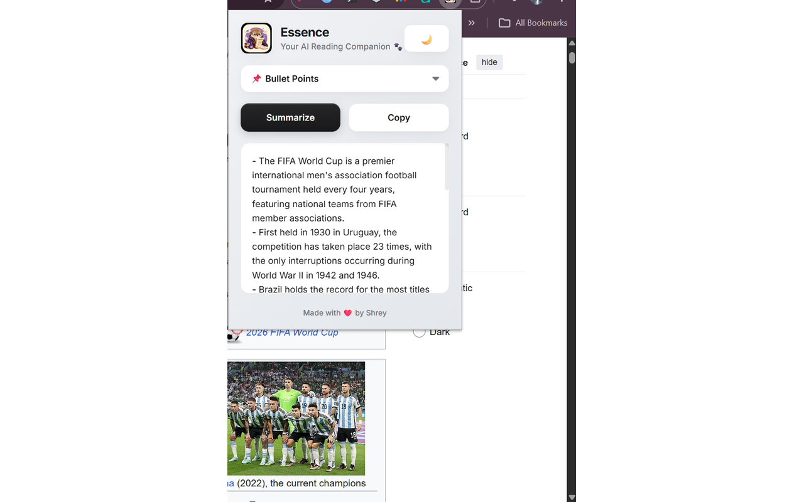
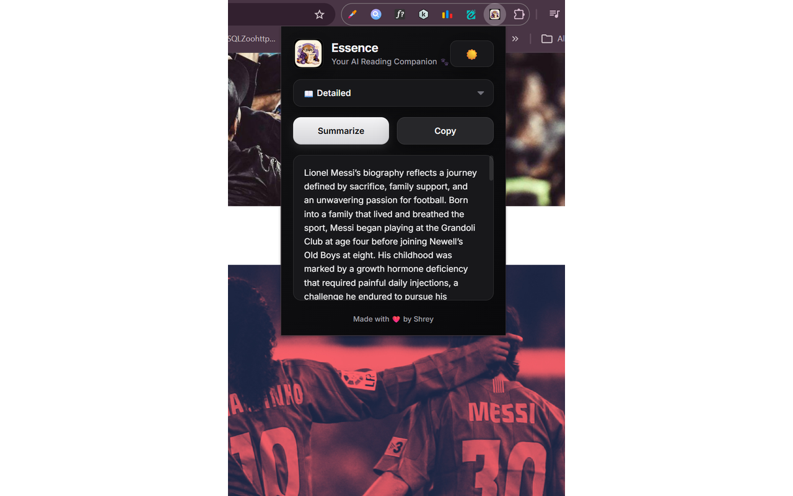
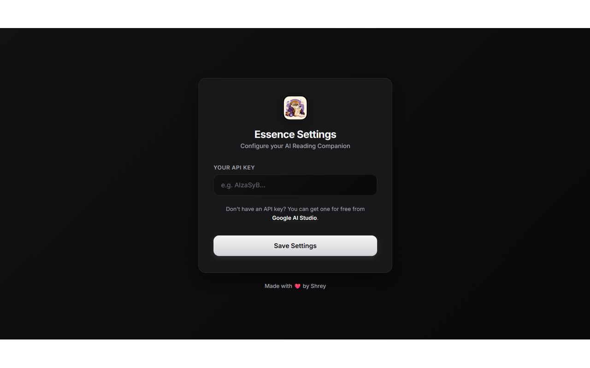

<div align="center">

# 🦦 Essence

### Your AI Reading Companion

AI-powered Chrome extension that instantly summarizes web articles using Google's Gemini AI.


</div>

---

## ✨ Features

- 🤖 AI-powered article summarization
- 📌 Three summary modes
  - Bullet Points
  - Brief
  - Detailed
- 🌙 Beautiful Light & Dark themes
- 📋 One-click copy
- ⚡ Fast and lightweight
- 🔒 Secure local API key storage
- 🌐 Works on most article websites

---

# 📸 Screenshots

## Light Theme



---

## Dark Theme



---

## Settings



---

# 🚀 Installation

## Chrome Web Store

Install directly from the Chrome Web Store.

> *(Chrome Web Store link will be added after publication.)*

---

## Manual Installation

Clone the repository

```bash
git clone https://github.com/CoderFish1/Essence.git
```

Open Chrome and visit

```
chrome://extensions
```

Enable **Developer Mode**.

Click **Load unpacked**.

Select the project folder.

Done!

---

# 🔑 Getting a Gemini API Key

Essence requires a free Gemini API key.

1. Visit

https://aistudio.google.com/

2. Sign in with your Google account.

3. Create a free API key.

4. Open **Essence Settings**.

5. Paste the key.

6. Click **Save Settings**.

---

# 💡 How to Use

1. Open any article.
2. Click the **Essence** extension.
3. Select your preferred summary mode.
4. Press **Summarize**.
5. Copy the generated summary if needed.

---

# 🛠 Built With

- HTML5
- CSS3
- JavaScript
- Chrome Extension Manifest V3
- Gemini API
- Chrome Storage API

---

# 📂 Project Structure

```
Essence
│
├── images/
│   ├── Essence_ChromeStore_Screenshot_1280x800.png
│   ├── Essence_Dark_ChromeStore_1280x800.png
│   ├── Essence_Settings_ChromeStore_1280x800.png
│   ├── marquee_essence.png
│   ├── small_promo_title_essence.png
│   └── store_icon_128.png
│
├── manifest.json
├── popup.html
├── popup.css
├── popup.js
├── content.js
├── background.js
├── options.html
├── options.css
├── options.js
├── README.md
└── ...
```

---

# 🔒 Privacy

Essence values your privacy.

- Your Gemini API key is stored locally using Chrome Storage.
- No browsing history is collected.
- No personal information is stored.
- No user data is sold or shared.
- Webpage content is processed only to generate summaries.

---

# 🤝 Contributing

Contributions, feature requests, and bug reports are welcome.

Feel free to fork the repository and submit a pull request.

---

# 🐞 Report Issues

Found a bug or have a feature request?

Please open an issue here:

https://github.com/CoderFish1/Essence/issues

---

# ⭐ Support

If you find this project useful, consider giving it a ⭐ on GitHub.

It really helps!

---

<div align="center">

Made with ❤️ by **Shrey Pandey**

</div>